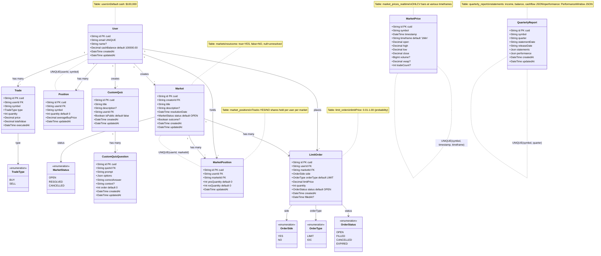

# Class Diagram: Database Entity Model (Prisma Schema)

```mermaid
classDiagram
    direction TB

    class TradeType {
        <<enumeration>>
        BUY
        SELL
    }

    class OrderSide {
        <<enumeration>>
        YES
        NO
    }

    class OrderType {
        <<enumeration>>
        LIMIT
        IOC
    }

    class MarketStatus {
        <<enumeration>>
        OPEN
        RESOLVED
        CANCELLED
    }

    class OrderStatus {
        <<enumeration>>
        OPEN
        FILLED
        CANCELLED
        EXPIRED
    }

    class User {
        +String id  PK cuid
        +String email  UNIQUE
        +String name?
        +Decimal cashBalance  default 100000.00
        +DateTime createdAt
        +DateTime updatedAt
    }

    class Trade {
        +String id  PK cuid
        +String userId  FK
        +String symbol
        +TradeType type
        +Int quantity
        +Decimal price
        +Decimal totalValue
        +DateTime executedAt
    }

    class Position {
        +String id  PK cuid
        +String userId  FK
        +String symbol
        +Int quantity  default 0
        +Decimal averageBuyPrice
        +DateTime updatedAt
    }

    class MarketPrice {
        +String id  PK cuid
        +String symbol
        +DateTime timestamp
        +String timeframe  default '1Min'
        +Decimal open
        +Decimal high
        +Decimal low
        +Decimal close
        +BigInt volume?
        +Decimal vwap?
        +Int tradeCount?
    }

    class QuarterlyReport {
        +String id  PK cuid
        +String symbol
        +String quarter
        +String statementDate
        +String releaseDate
        +Json statements
        +Json performance
        +DateTime createdAt
        +DateTime updatedAt
    }

    class CustomQuiz {
        +String id  PK cuid
        +String title
        +String description?
        +String userId  FK
        +Boolean isPublic  default false
        +DateTime createdAt
        +DateTime updatedAt
    }

    class CustomQuizQuestion {
        +String id  PK cuid
        +String quizId  FK
        +String prompt
        +Json options
        +String correctAnswer
        +String context?
        +Int order  default 0
        +DateTime createdAt
        +DateTime updatedAt
    }

    class Market {
        +String id  PK cuid
        +String creatorId  FK
        +String title
        +String description?
        +DateTime resolutionDate
        +MarketStatus status  default OPEN
        +Boolean outcome?
        +DateTime createdAt
        +DateTime updatedAt
    }

    class MarketPosition {
        +String id  PK cuid
        +String userId  FK
        +String marketId  FK
        +Int yesQuantity  default 0
        +Int noQuantity  default 0
        +DateTime updatedAt
    }

    class LimitOrder {
        +String id  PK cuid
        +String userId  FK
        +String marketId  FK
        +OrderSide side
        +OrderType orderType  default LIMIT
        +Decimal limitPrice
        +Int quantity
        +OrderStatus status  default OPEN
        +DateTime createdAt
        +DateTime filledAt?
    }

    %% Relationships
    User "1" --> "*" Trade : has many
    User "1" --> "*" Position : has many
    User "1" --> "*" CustomQuiz : creates
    User "1" --> "*" Market : creates
    User "1" --> "*" MarketPosition : holds
    User "1" --> "*" LimitOrder : places

    Position .. User : UNIQUE(userId, symbol)

    CustomQuiz "1" --> "*" CustomQuizQuestion : has many

    Market "1" --> "*" MarketPosition : has many
    Market "1" --> "*" LimitOrder : has many
    MarketPosition .. Market : UNIQUE(userId, marketId)

    Trade --> TradeType : type
    LimitOrder --> OrderSide : side
    LimitOrder --> OrderType : orderType
    LimitOrder --> OrderStatus : status
    Market --> MarketStatus : status

    MarketPrice .. MarketPrice : UNIQUE(symbol, timestamp, timeframe)
    QuarterlyReport .. QuarterlyReport : UNIQUE(symbol, quarter)

    note for User "Table: users\nDefault cash: $100,000"
    note for Market "Table: markets\noutcome: true=YES, false=NO, null=unresolved"
    note for MarketPosition "Table: market_positions\nTracks YES/NO shares held per user per market"
    note for LimitOrder "Table: limit_orders\nlimitPrice: 0.01-1.00 (probability)"
    note for MarketPrice "Table: market_prices_realtime\nOHLCV bars at various timeframes"
    note for QuarterlyReport "Table: quarterly_reports\nstatements: income, balance, cashflow JSON\nperformance: PerformanceWindow JSON"
```
