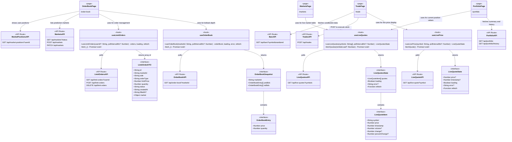

# Class Diagram: React Hooks (Client-Side Data Layer)

```mermaid
classDiagram
    direction TB

    %% === Hook Return Types ===

    class LiveQuoteState {
        <<interface>>
        +Number price?
        +Number timestamp?
        +Boolean loading
        +String error?
        +Function refetch
    }

    class LiveQuoteItem {
        <<interface>>
        +String symbol
        +Number price
        +Number timestamp
        +Number volume?
        +Number change?
        +Number percentChange?
    }

    class LiveQuotesState {
        <<interface>>
        +LiveQuoteItem[] quotes
        +Boolean loading
        +String error?
        +Function refetch
    }

    class LimitOrderDTO {
        <<interface>>
        +String id
        +String marketId
        +String side
        +String orderType
        +Number limitPrice
        +Number quantity
        +String status
        +String createdAt
        +String filledAt?
        +Object market
    }

    class OrderBookSnapshot {
        <<interface>>
        +String marketId
        +OrderBookEntry[] yesBids
        +OrderBookEntry[] noBids
    }

    class OrderBookEntry {
        <<interface>>
        +Number price
        +Number quantity
    }

    %% === Hooks ===

    class useLivePrice {
        <<hook>>
        +useLivePrice(symbol: String, pollIntervalMs?: Number) LiveQuoteState
        -fetchQuote() Promise~void~
    }

    class useLiveQuotes {
        <<hook>>
        +useLiveQuotes(symbols: String[], pollIntervalMs?: Number) LiveQuotesState
        -fetchQuotes(isInitialLoad?: Boolean) Promise~void~
    }

    class useLimitOrders {
        <<hook>>
        +useLimitOrders(userId?: String, pollIntervalMs?: Number) orders, loading, refetch
        -fetch_() Promise~void~
    }

    class useOrderBook {
        <<hook>>
        +useOrderBook(marketId: String, pollIntervalMs?: Number) orderBook, loading, error, refetch
        -fetch_() Promise~void~
    }

    %% === API Routes (polled by hooks) ===

    class LiveQuoteAPI {
        <<API Route>>
        GET /api/live-quote?symbol
    }

    class LiveQuotesAPI {
        <<API Route>>
        GET /api/live-quotes?symbols
    }

    class LimitOrdersAPI {
        <<API Route>>
        GET /api/limit-orders?userId
        POST /api/limit-orders
        DELETE /api/limit-orders
    }

    class OrderBookAPI {
        <<API Route>>
        GET /api/order-book?marketId
    }

    class MarketsAPI {
        <<API Route>>
        GET /api/markets?status
        POST /api/markets
        PATCH /api/markets
    }

    class MarketPositionsAPI {
        <<API Route>>
        GET /api/market-positions?userId
    }

    class TradesAPI {
        <<API Route>>
        POST /api/trades
    }

    class PortfolioAPI {
        <<API Route>>
        GET /api/portfolio
        GET /api/portfolio/history
    }

    class BarsAPI {
        <<API Route>>
        GET /api/bars?symbol&start&end
    }

    %% === Page Components ===

    class TradePage {
        <<page>>
        /trade
    }

    class MarketsPage {
        <<page>>
        /markets
    }

    class PortfolioPage {
        <<page>>
        /portfolio
    }

    class OrderBookPage {
        <<page>>
        /order-book
    }

    %% === Hook return types ===
    useLivePrice --> LiveQuoteState : returns
    useLiveQuotes --> LiveQuotesState : returns
    LiveQuotesState --> LiveQuoteItem : contains
    useLimitOrders --> LimitOrderDTO : returns array of
    useOrderBook --> OrderBookSnapshot : returns
    OrderBookSnapshot --> OrderBookEntry : contains

    %% === Hook -> API polling ===
    useLivePrice --> LiveQuoteAPI : polls
    useLiveQuotes --> LiveQuotesAPI : polls
    useLimitOrders --> LimitOrdersAPI : polls
    useOrderBook --> OrderBookAPI : polls

    %% === Page -> Hook / API usage ===
    TradePage --> useLivePrice : uses for live price display
    TradePage --> TradesAPI : POST to execute stock trades
    TradePage --> BarsAPI : fetches candlestick data

    MarketsPage --> useLiveQuotes : uses for live market table

    PortfolioPage --> PortfolioAPI : fetches summary and history
    PortfolioPage --> useLiveQuotes : uses for current position values

    OrderBookPage --> useOrderBook : uses for bid/ask depth
    OrderBookPage --> useLimitOrders : uses for order management
    OrderBookPage --> MarketsAPI : lists prediction markets
    OrderBookPage --> MarketPositionsAPI : shows user positions
```
