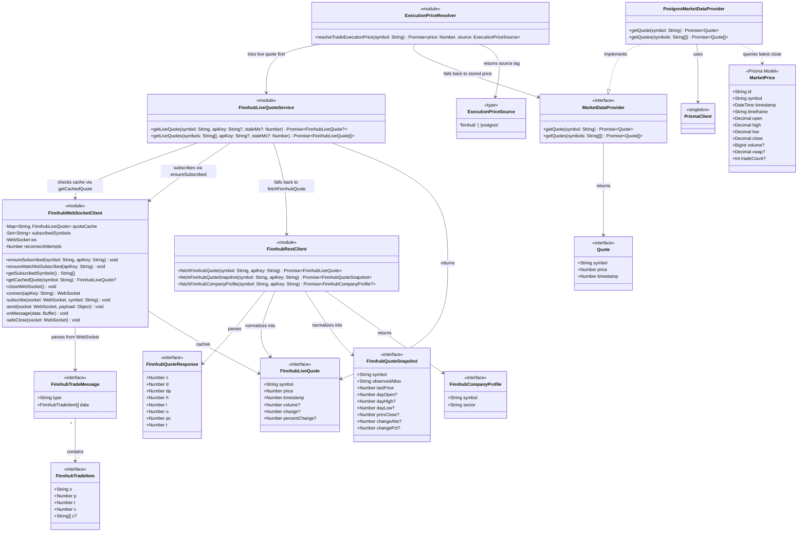

# Class Diagram: Market Data System

```mermaid
classDiagram
    direction TB

    %% === Finnhub API Response Types ===

    class FinnhubQuoteResponse {
        <<interface>>
        +Number c
        +Number d
        +Number dp
        +Number h
        +Number l
        +Number o
        +Number pc
        +Number t
    }

    class FinnhubTradeItem {
        <<interface>>
        +String s
        +Number p
        +Number t
        +Number v
        +String[] c?
    }

    class FinnhubTradeMessage {
        <<interface>>
        +String type
        +FinnhubTradeItem[] data
    }

    %% === Normalized Application Types ===

    class FinnhubLiveQuote {
        <<interface>>
        +String symbol
        +Number price
        +Number timestamp
        +Number volume?
        +Number change?
        +Number percentChange?
    }

    class FinnhubQuoteSnapshot {
        <<interface>>
        +String symbol
        +String observedAtIso
        +Number lastPrice
        +Number dayOpen?
        +Number dayHigh?
        +Number dayLow?
        +Number prevClose?
        +Number changeAbs?
        +Number changePct?
    }

    class FinnhubCompanyProfile {
        <<interface>>
        +String symbol
        +String sector
    }

    class ExecutionPriceSource {
        <<type>>
        'finnhub' | 'postgres'
    }

    %% === WebSocket Client (Module) ===

    class FinnhubWebSocketClient {
        <<module>>
        -Map~String‚ FinnhubLiveQuote~ quoteCache
        -Set~String~ subscribedSymbols
        -WebSocket ws
        -Number reconnectAttempts
        +ensureSubscribed(symbol: String, apiKey: String) void
        +ensureWatchlistSubscribed(apiKey: String) void
        +getSubscribedSymbols() String[]
        +getCachedQuote(symbol: String) FinnhubLiveQuote?
        +closeWebSocket() void
        -connect(apiKey: String) WebSocket
        -subscribe(socket: WebSocket, symbol: String) void
        -send(socket: WebSocket, payload: Object) void
        -onMessage(data: Buffer) void
        -safeClose(socket: WebSocket) void
    }

    %% === REST Client (Module) ===

    class FinnhubRestClient {
        <<module>>
        +fetchFinnhubQuote(symbol: String, apiKey: String) Promise~FinnhubLiveQuote~
        +fetchFinnhubQuoteSnapshot(symbol: String, apiKey: String) Promise~FinnhubQuoteSnapshot~
        +fetchFinnhubCompanyProfile(symbol: String, apiKey: String) Promise~FinnhubCompanyProfile?~
    }

    %% === Live Quote Service (Module) ===

    class FinnhubLiveQuoteService {
        <<module>>
        +getLiveQuote(symbol: String, apiKey: String?, staleMs?: Number) Promise~FinnhubLiveQuote?~
        +getLiveQuotes(symbols: String[], apiKey: String?, staleMs?: Number) Promise~FinnhubLiveQuote[]~
    }

    %% === Execution Price Resolver (Module) ===

    class ExecutionPriceResolver {
        <<module>>
        +resolveTradeExecutionPrice(symbol: String) Promise~price: Number‚ source: ExecutionPriceSource~
    }

    %% === Stored Market Data ===

    class Quote {
        <<interface>>
        +String symbol
        +Number price
        +Number timestamp
    }

    class MarketDataProvider {
        <<interface>>
        +getQuote(symbol: String) Promise~Quote~
        +getQuotes(symbols: String[]) Promise~Quote[]~
    }

    class PostgresMarketDataProvider {
        +getQuote(symbol: String) Promise~Quote~
        +getQuotes(symbols: String[]) Promise~Quote[]~
    }

    class MarketPrice {
        <<Prisma Model>>
        +String id
        +String symbol
        +DateTime timestamp
        +String timeframe
        +Decimal open
        +Decimal high
        +Decimal low
        +Decimal close
        +BigInt volume?
        +Decimal vwap?
        +Int tradeCount?
    }

    class PrismaClient {
        <<singleton>>
    }

    %% === Relationships ===

    %% Interface implementation
    PostgresMarketDataProvider ..|> MarketDataProvider : implements
    MarketDataProvider --> Quote : returns

    %% Live Quote Service orchestration
    FinnhubLiveQuoteService --> FinnhubWebSocketClient : checks cache via getCachedQuote
    FinnhubLiveQuoteService --> FinnhubWebSocketClient : subscribes via ensureSubscribed
    FinnhubLiveQuoteService --> FinnhubRestClient : falls back to fetchFinnhubQuote
    FinnhubLiveQuoteService --> FinnhubLiveQuote : returns

    %% WebSocket internals
    FinnhubWebSocketClient --> FinnhubTradeMessage : parses from WebSocket
    FinnhubTradeMessage "1" --> "*" FinnhubTradeItem : contains
    FinnhubWebSocketClient --> FinnhubLiveQuote : caches

    %% REST Client returns
    FinnhubRestClient --> FinnhubQuoteResponse : parses
    FinnhubRestClient --> FinnhubLiveQuote : normalizes into
    FinnhubRestClient --> FinnhubQuoteSnapshot : normalizes into
    FinnhubRestClient --> FinnhubCompanyProfile : returns

    %% Execution price resolution
    ExecutionPriceResolver --> FinnhubLiveQuoteService : tries live quote first
    ExecutionPriceResolver --> MarketDataProvider : falls back to stored price
    ExecutionPriceResolver --> ExecutionPriceSource : returns source tag

    %% Postgres provider
    PostgresMarketDataProvider --> PrismaClient : uses
    PostgresMarketDataProvider ..> MarketPrice : queries latest close
```
