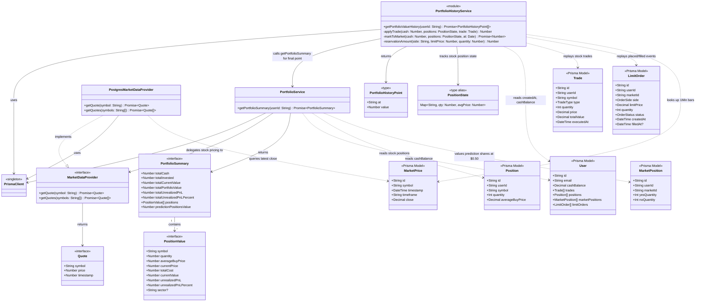

# Class Diagram: Portfolio System

```mermaid
classDiagram
    direction TB

    class PositionValue {
        <<interface>>
        +String symbol
        +Number quantity
        +Number averageBuyPrice
        +Number currentPrice
        +Number totalCost
        +Number currentValue
        +Number unrealizedPnL
        +Number unrealizedPnLPercent
        +String sector?
    }

    class PortfolioSummary {
        <<interface>>
        +Number totalCash
        +Number totalInvested
        +Number totalCurrentValue
        +Number totalPortfolioValue
        +Number totalUnrealizedPnL
        +Number totalUnrealizedPnLPercent
        +PositionValue[] positions
        +Number predictionPositionsValue
    }

    class PortfolioHistoryPoint {
        <<type>>
        +String at
        +Number value
    }

    class Quote {
        <<interface>>
        +String symbol
        +Number price
        +Number timestamp
    }

    class MarketDataProvider {
        <<interface>>
        +getQuote(symbol: String) Promise~Quote~
        +getQuotes(symbols: String[]) Promise~Quote[]~
    }

    class PostgresMarketDataProvider {
        +getQuote(symbol: String) Promise~Quote~
        +getQuotes(symbols: String[]) Promise~Quote[]~
    }

    class PortfolioService {
        +getPortfolioSummary(userId: String) Promise~PortfolioSummary~
    }

    class PortfolioHistoryService {
        <<module>>
        +getPortfolioValueHistory(userId: String) Promise~PortfolioHistoryPoint[]~
        -applyTrade(cash: Number, positions: PositionState, trade: Trade) Number
        -markToMarket(cash: Number, positions: PositionState, at: Date) Promise~Number~
        -reservationAmount(side: String, limitPrice: Number, quantity: Number) Number
    }

    class PositionState {
        <<type alias>>
        Map~String‚ qty: Number‚ avgPrice: Number~
    }

    class User {
        <<Prisma Model>>
        +String id
        +String email
        +Decimal cashBalance
        +Trade[] trades
        +Position[] positions
        +MarketPosition[] marketPositions
        +LimitOrder[] limitOrders
    }

    class Position {
        <<Prisma Model>>
        +String id
        +String userId
        +String symbol
        +Int quantity
        +Decimal averageBuyPrice
    }

    class Trade {
        <<Prisma Model>>
        +String id
        +String userId
        +String symbol
        +TradeType type
        +Int quantity
        +Decimal price
        +Decimal totalValue
        +DateTime executedAt
    }

    class MarketPosition {
        <<Prisma Model>>
        +String id
        +String userId
        +String marketId
        +Int yesQuantity
        +Int noQuantity
    }

    class LimitOrder {
        <<Prisma Model>>
        +String id
        +String userId
        +String marketId
        +OrderSide side
        +Decimal limitPrice
        +Int quantity
        +OrderStatus status
        +DateTime createdAt
        +DateTime filledAt?
    }

    class MarketPrice {
        <<Prisma Model>>
        +String id
        +String symbol
        +DateTime timestamp
        +String timeframe
        +Decimal close
    }

    class PrismaClient {
        <<singleton>>
    }

    %% Interface implementation
    PostgresMarketDataProvider ..|> MarketDataProvider : implements
    MarketDataProvider --> Quote : returns

    %% PortfolioService dependencies
    PortfolioService --> PrismaClient : uses
    PortfolioService --> MarketDataProvider : delegates stock pricing to
    PortfolioService --> PortfolioSummary : returns
    PortfolioService ..> User : reads cashBalance
    PortfolioService ..> Position : reads stock positions
    PortfolioService ..> MarketPosition : values prediction shares at $0.50

    %% PortfolioHistoryService dependencies
    PortfolioHistoryService --> PrismaClient : uses
    PortfolioHistoryService --> PortfolioService : calls getPortfolioSummary for final point
    PortfolioHistoryService --> PortfolioHistoryPoint : returns
    PortfolioHistoryService --> PositionState : tracks stock position state
    PortfolioHistoryService ..> User : reads createdAt, cashBalance
    PortfolioHistoryService ..> Trade : replays stock trades
    PortfolioHistoryService ..> LimitOrder : replays placed/filled events
    PortfolioHistoryService ..> MarketPrice : looks up 1Min bars

    PostgresMarketDataProvider --> PrismaClient : uses
    PostgresMarketDataProvider ..> MarketPrice : queries latest close

    %% Return type composition
    PortfolioSummary "1" --> "*" PositionValue : contains
```
