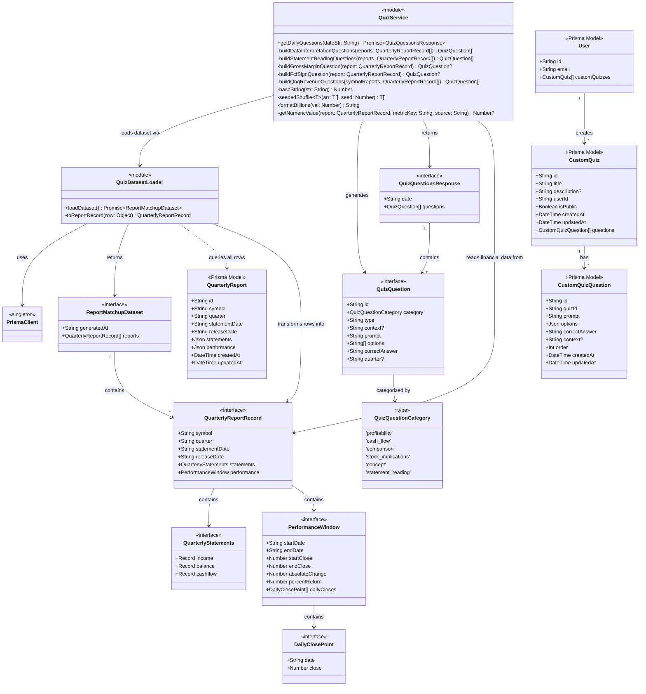

# Class Diagram: Quiz System

```mermaid
classDiagram
    direction TB

    class QuizQuestionCategory {
        <<type>>
        'profitability'
        'cash_flow'
        'comparison'
        'stock_implications'
        'concept'
        'statement_reading'
    }

    class QuizQuestion {
        <<interface>>
        +String id
        +QuizQuestionCategory category
        +String type
        +String context?
        +String prompt
        +String[] options
        +String correctAnswer
        +String quarter?
    }

    class QuizQuestionsResponse {
        <<interface>>
        +String date
        +QuizQuestion[] questions
    }

    class QuarterlyReportRecord {
        <<interface>>
        +String symbol
        +String quarter
        +String statementDate
        +String releaseDate
        +QuarterlyStatements statements
        +PerformanceWindow performance
    }

    class QuarterlyStatements {
        <<interface>>
        +Record income
        +Record balance
        +Record cashflow
    }

    class PerformanceWindow {
        <<interface>>
        +String startDate
        +String endDate
        +Number startClose
        +Number endClose
        +Number absoluteChange
        +Number percentReturn
        +DailyClosePoint[] dailyCloses
    }

    class DailyClosePoint {
        <<interface>>
        +String date
        +Number close
    }

    class ReportMatchupDataset {
        <<interface>>
        +String generatedAt
        +QuarterlyReportRecord[] reports
    }

    class QuizService {
        <<module>>
        +getDailyQuestions(dateStr: String) Promise~QuizQuestionsResponse~
        -buildDataInterpretationQuestions(reports: QuarterlyReportRecord[]) QuizQuestion[]
        -buildStatementReadingQuestions(reports: QuarterlyReportRecord[]) QuizQuestion[]
        -buildGrossMarginQuestion(report: QuarterlyReportRecord) QuizQuestion?
        -buildFcfSignQuestion(report: QuarterlyReportRecord) QuizQuestion?
        -buildQoqRevenueQuestions(symbolReports: QuarterlyReportRecord[]) QuizQuestion[]
        -hashString(str: String) Number
        -seededShuffle~T~(arr: T[], seed: Number) T[]
        -formatBillions(val: Number) String
        -getNumericValue(report: QuarterlyReportRecord, metricKey: String, source: String) Number?
    }

    class QuizDatasetLoader {
        <<module>>
        +loadDataset() Promise~ReportMatchupDataset~
        -toReportRecord(row: Object) QuarterlyReportRecord
    }

    class QuarterlyReport {
        <<Prisma Model>>
        +String id
        +String symbol
        +String quarter
        +String statementDate
        +String releaseDate
        +Json statements
        +Json performance
        +DateTime createdAt
        +DateTime updatedAt
    }

    class CustomQuiz {
        <<Prisma Model>>
        +String id
        +String title
        +String description?
        +String userId
        +Boolean isPublic
        +DateTime createdAt
        +DateTime updatedAt
        +CustomQuizQuestion[] questions
    }

    class CustomQuizQuestion {
        <<Prisma Model>>
        +String id
        +String quizId
        +String prompt
        +Json options
        +String correctAnswer
        +String context?
        +Int order
        +DateTime createdAt
        +DateTime updatedAt
    }

    class User {
        <<Prisma Model>>
        +String id
        +String email
        +CustomQuiz[] customQuizzes
    }

    class PrismaClient {
        <<singleton>>
    }

    %% Service dependencies
    QuizService --> QuizDatasetLoader : loads dataset via
    QuizService --> QuizQuestion : generates
    QuizService --> QuizQuestionsResponse : returns
    QuizService --> QuarterlyReportRecord : reads financial data from

    QuizDatasetLoader --> PrismaClient : uses
    QuizDatasetLoader --> ReportMatchupDataset : returns
    QuizDatasetLoader ..> QuarterlyReport : queries all rows
    QuizDatasetLoader --> QuarterlyReportRecord : transforms rows into

    %% Type composition
    QuarterlyReportRecord --> QuarterlyStatements : contains
    QuarterlyReportRecord --> PerformanceWindow : contains
    PerformanceWindow --> DailyClosePoint : contains
    ReportMatchupDataset "1" --> "*" QuarterlyReportRecord : contains
    QuizQuestionsResponse "1" --> "5" QuizQuestion : contains
    QuizQuestion --> QuizQuestionCategory : categorized by

    %% Custom quiz relationships
    User "1" --> "*" CustomQuiz : creates
    CustomQuiz "1" --> "*" CustomQuizQuestion : has
```
