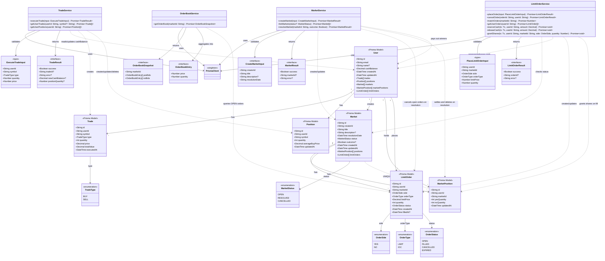

# Class Diagram: Trading & Prediction Market System

```mermaid
classDiagram
    direction TB

    class TradeType {
        <<enumeration>>
        BUY
        SELL
    }

    class OrderSide {
        <<enumeration>>
        YES
        NO
    }

    class OrderType {
        <<enumeration>>
        LIMIT
        IOC
    }

    class MarketStatus {
        <<enumeration>>
        OPEN
        RESOLVED
        CANCELLED
    }

    class OrderStatus {
        <<enumeration>>
        OPEN
        FILLED
        CANCELLED
        EXPIRED
    }

    class ExecuteTradeInput {
        <<type>>
        +String userId
        +String symbol
        +TradeType type
        +Number quantity
        +Number price
    }

    class TradeResult {
        <<interface>>
        +Boolean success
        +String tradeId?
        +String error?
        +Decimal newCashBalance?
        +Number positionQuantity?
    }

    class PlaceLimitOrderInput {
        <<type>>
        +String userId
        +String marketId
        +OrderSide side
        +OrderType orderType
        +Number limitPrice
        +Number quantity
    }

    class LimitOrderResult {
        <<interface>>
        +Boolean success
        +String orderId?
        +String error?
    }

    class CreateMarketInput {
        <<interface>>
        +String creatorId
        +String title
        +String description?
        +String resolutionDate
    }

    class MarketResult {
        <<interface>>
        +Boolean success
        +String marketId?
        +String error?
    }

    class OrderBookEntry {
        <<interface>>
        +Number price
        +Number quantity
    }

    class OrderBookSnapshot {
        <<interface>>
        +String marketId
        +OrderBookEntry[] yesBids
        +OrderBookEntry[] noBids
    }

    class TradeService {
        +executeTrade(input: ExecuteTradeInput) Promise~TradeResult~
        +getUserTrades(userId: String, symbol?: String) Promise~Trade[]~
        +getUserPositions(userId: String) Promise~Position[]~
    }

    class MarketService {
        +createMarket(input: CreateMarketInput) Promise~MarketResult~
        +listMarkets(status?: MarketStatus) Promise~Market[]~
        +resolveMarket(marketId: String, outcome: Boolean) Promise~MarketResult~
    }

    class LimitOrderService {
        +placeOrder(input: PlaceLimitOrderInput) Promise~LimitOrderResult~
        +cancelOrder(orderId: String, userId: String) Promise~LimitOrderResult~
        +matchOrders(marketId: String) Promise~Number~
        +getUserOrders(userId: String) Promise~LimitOrder[]~
        -reserveCash(tx: Tx, userId: String, amount: Decimal) Promise~void~
        -releaseCash(tx: Tx, userId: String, amount: Decimal) Promise~void~
        -grantShares(tx: Tx, userId: String, marketId: String, side: OrderSide, quantity: Number) Promise~void~
    }

    class OrderBookService {
        +getOrderBook(marketId: String) Promise~OrderBookSnapshot~
    }

    class User {
        <<Prisma Model>>
        +String id
        +String email
        +String name?
        +Decimal cashBalance
        +DateTime createdAt
        +DateTime updatedAt
        +Trade[] trades
        +Position[] positions
        +Market[] markets
        +MarketPosition[] marketPositions
        +LimitOrder[] limitOrders
    }

    class Trade {
        <<Prisma Model>>
        +String id
        +String userId
        +String symbol
        +TradeType type
        +Int quantity
        +Decimal price
        +Decimal totalValue
        +DateTime executedAt
    }

    class Position {
        <<Prisma Model>>
        +String id
        +String userId
        +String symbol
        +Int quantity
        +Decimal averageBuyPrice
        +DateTime updatedAt
    }

    class Market {
        <<Prisma Model>>
        +String id
        +String creatorId
        +String title
        +String description?
        +DateTime resolutionDate
        +MarketStatus status
        +Boolean outcome?
        +DateTime createdAt
        +DateTime updatedAt
        +MarketPosition[] positions
        +LimitOrder[] limitOrders
    }

    class MarketPosition {
        <<Prisma Model>>
        +String id
        +String userId
        +String marketId
        +Int yesQuantity
        +Int noQuantity
        +DateTime updatedAt
    }

    class LimitOrder {
        <<Prisma Model>>
        +String id
        +String userId
        +String marketId
        +OrderSide side
        +OrderType orderType
        +Decimal limitPrice
        +Int quantity
        +OrderStatus status
        +DateTime createdAt
        +DateTime filledAt?
    }

    class PrismaClient {
        <<singleton>>
    }

    %% Stock trading service dependencies
    TradeService --> PrismaClient : uses
    TradeService --> ExecuteTradeInput : validates
    TradeService --> TradeResult : returns
    TradeService ..> User : reads/updates cashBalance
    TradeService ..> Trade : creates
    TradeService ..> Position : creates/updates/deletes

    %% Market service dependencies
    MarketService --> PrismaClient : uses
    MarketService --> CreateMarketInput : validates
    MarketService --> MarketResult : returns
    MarketService ..> Market : creates/updates
    MarketService ..> LimitOrder : cancels open orders on resolution
    MarketService ..> MarketPosition : settles and deletes on resolution
    MarketService ..> User : pays out winners

    %% Limit order service dependencies (prediction market)
    LimitOrderService --> PrismaClient : uses
    LimitOrderService --> PlaceLimitOrderInput : validates
    LimitOrderService --> LimitOrderResult : returns
    LimitOrderService ..> Market : checks status
    LimitOrderService ..> User : reserves/releases cash
    LimitOrderService ..> LimitOrder : creates/updates
    LimitOrderService ..> MarketPosition : grants shares on fill

    %% Order book service
    OrderBookService --> PrismaClient : uses
    OrderBookService --> OrderBookSnapshot : returns
    OrderBookService --> OrderBookEntry : aggregates into
    OrderBookService ..> LimitOrder : queries OPEN orders

    %% Data model relationships
    User "1" --> "*" Trade : has
    User "1" --> "*" Position : has
    User "1" --> "*" Market : creates
    User "1" --> "*" MarketPosition : holds
    User "1" --> "*" LimitOrder : places

    Market "1" --> "*" MarketPosition : has
    Market "1" --> "*" LimitOrder : has
    MarketPosition .. Market : UNIQUE(userId, marketId)

    Trade --> TradeType : type
    LimitOrder --> OrderSide : side
    LimitOrder --> OrderType : orderType
    LimitOrder --> OrderStatus : status
    Market --> MarketStatus : status
```
