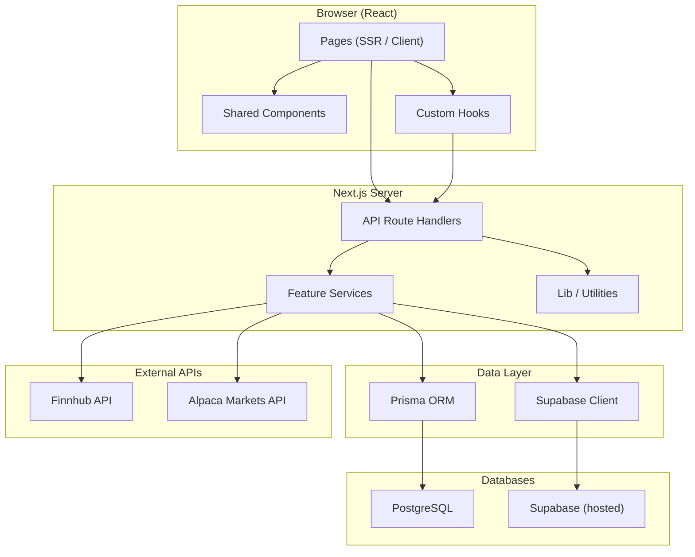
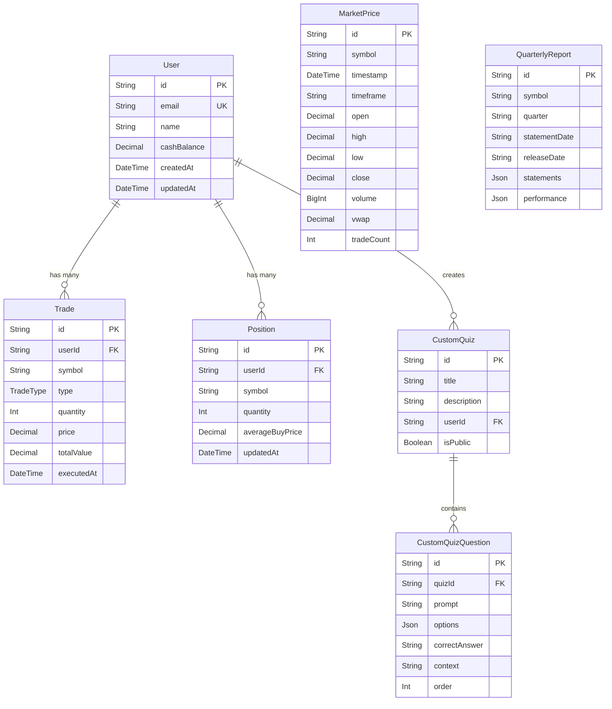
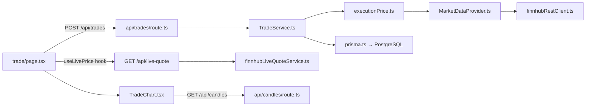
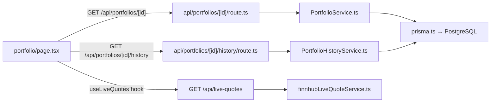
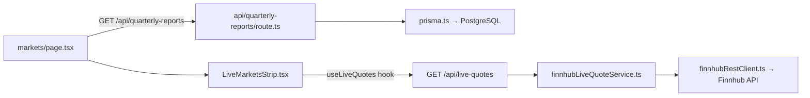
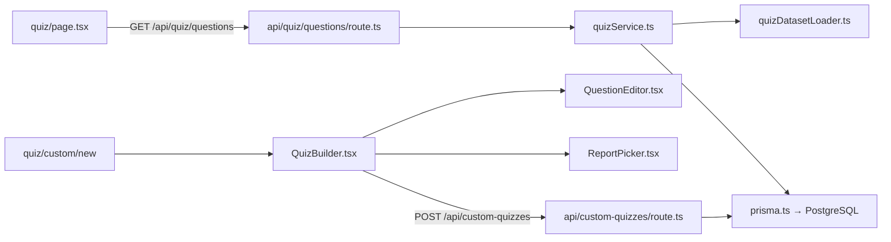
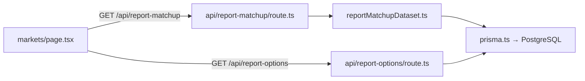
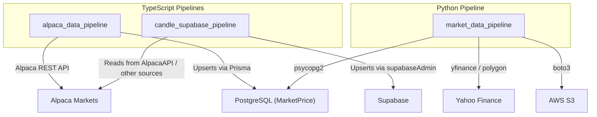
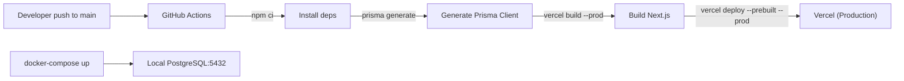

# InvestEd — Project Structure & Dependency Map

**InvestEd** is a full-stack stock-trading simulator / financial education platform built with **Next.js 16**, **Prisma**, **PostgreSQL**, and **Supabase**, deployed on **Vercel**.

---

## Tech Stack Summary

| Layer | Technology |
|---|---|
| Framework | Next.js 16 (App Router) |
| Language | TypeScript 5.5 |
| UI | React 19, Tailwind CSS 3.4, Recharts, Lightweight Charts |
| ORM / DB | Prisma 5 → PostgreSQL 16 |
| Realtime Store | Supabase (candle / quote snapshots) |
| Market Data | Finnhub (REST + WebSocket), Alpaca Bars API |
| Validation | Zod |
| CI/CD | GitHub Actions → Vercel |
| Local Dev DB | Docker Compose (Postgres 16 Alpine) |

---

## High-Level Architecture



---

## Folder Hierarchy (Annotated)

```
OOPs/                              ← Repository root
├── .env / .env.example            ← Environment variables
├── .github/workflows/deploy.yml   ← CI/CD: GitHub Actions → Vercel
├── docker-compose.yml             ← Local Postgres container
├── package.json                   ← npm scripts, deps
├── next.config.js                 ← Next.js config (ws external, transpile)
├── tailwind.config.ts             ← Tailwind theme
├── tsconfig.json                  ← TypeScript config
├── prisma/
│   └── schema.prisma              ← Database schema (6 models + 1 enum)
│
├── src/                           ← ★ APPLICATION SOURCE ★
│   ├── app/                       ← Next.js App Router
│   │   ├── layout.tsx             ← Root layout (HTML shell)
│   │   ├── page.tsx               ← Landing page (/)
│   │   ├── globals.css            ← Global styles
│   │   ├── error.tsx              ← Root error boundary
│   │   │
│   │   ├── (dashboard)/           ← Route group (shared sidebar layout)
│   │   │   ├── layout.tsx         ← Dashboard shell with navigation
│   │   │   ├── error.tsx          ← Dashboard error boundary
│   │   │   ├── markets/page.tsx   ← /markets — live market view
│   │   │   ├── portfolio/page.tsx ← /portfolio — holdings & history
│   │   │   ├── trade/page.tsx     ← /trade — buy/sell interface
│   │   │   └── quiz/              ← /quiz — educational quizzes
│   │   │       ├── page.tsx       ← Quiz landing
│   │   │       └── custom/        ← Custom quiz CRUD
│   │   │           ├── page.tsx       ← List user's custom quizzes
│   │   │           ├── new/page.tsx   ← Create new quiz
│   │   │           └── [id]/
│   │   │               ├── page.tsx   ← Take/view a custom quiz
│   │   │               └── edit/      ← Edit existing quiz
│   │   │
│   │   └── api/                   ← Server-side API route handlers
│   │       ├── bars/route.ts          ← GET historical OHLC bars
│   │       ├── candles/route.ts       ← GET candle data (Supabase)
│   │       ├── live-quote/route.ts    ← GET single live quote
│   │       ├── live-quotes/route.ts   ← GET batch live quotes
│   │       ├── quote/route.ts         ← GET stock quote
│   │       ├── quote-snapshots/route.ts ← GET quote snapshots
│   │       ├── trades/route.ts        ← POST execute trade
│   │       ├── portfolio/
│   │       │   ├── route.ts           ← GET portfolio summary
│   │       │   └── history/route.ts   ← GET portfolio value history
│   │       ├── quarterly-reports/route.ts ← GET financial statements
│   │       ├── report-matchup/route.ts    ← GET report matchup game data
│   │       ├── report-options/route.ts    ← GET report dropdown options
│   │       ├── quiz/questions/route.ts    ← GET quiz questions
│   │       └── custom-quizzes/
│   │           ├── route.ts           ← GET/POST custom quizzes
│   │           └── [id]/
│   │               ├── route.ts       ← GET/PUT/DELETE single quiz
│   │               └── questions/     ← Nested quiz question endpoints
│   │
│   ├── components/                ← Shared React components
│   │   ├── LiveMarketsStrip.tsx   ← Scrolling live-price ticker bar
│   │   ├── ui/                    ← Generic UI primitives
│   │   │   ├── button.tsx         ← Reusable Button (CVA variants)
│   │   │   └── TradeChart.tsx     ← Candlestick chart (Lightweight Charts)
│   │   └── quiz/                  ← Quiz-specific UI components
│   │       ├── QuestionEditor.tsx ← Edit a single question form
│   │       ├── QuizBuilder.tsx    ← Multi-question quiz builder
│   │       └── ReportPicker.tsx   ← Pick reports for quiz context
│   │
│   ├── features/                  ← Domain logic / service layer
│   │   ├── market-data/
│   │   │   ├── MarketDataProvider.ts  ← Abstraction over data sources
│   │   │   ├── executionPrice.ts      ← Price execution logic
│   │   │   └── finnhub/              ← Finnhub integration module
│   │   │       ├── index.ts
│   │   │       ├── types.ts
│   │   │       ├── finnhubRestClient.ts
│   │   │       ├── finnhubWebSocketClient.ts
│   │   │       ├── finnhubLiveQuoteService.ts
│   │   │       └── watchlistSymbols.ts
│   │   ├── portfolio/
│   │   │   ├── PortfolioService.ts        ← Portfolio CRUD & calculations
│   │   │   └── PortfolioHistoryService.ts ← Historical portfolio valuation
│   │   ├── trading/
│   │   │   └── TradeService.ts    ← Trade execution business logic
│   │   ├── quiz/
│   │   │   ├── quizService.ts         ← Quiz generation & scoring
│   │   │   └── quizDatasetLoader.ts   ← Load quiz question datasets
│   │   └── report-matchup/
│   │       └── reportMatchupDataset.ts ← Quarterly report game logic
│   │
│   ├── hooks/                     ← React custom hooks
│   │   ├── useLivePrice.ts        ← Single-symbol live price hook
│   │   └── useLiveQuotes.ts       ← Multi-symbol live quotes hook
│   │
│   ├── lib/                       ← Shared utilities
│   │   ├── prisma.ts              ← Singleton PrismaClient
│   │   ├── utils.ts               ← General helpers (cn, etc.)
│   │   └── live-markets-symbols.ts ← Default symbol list for ticker
│   │
│   └── types/                     ← TypeScript type definitions
│       ├── index.ts               ← Re-exports
│       ├── market-data.ts         ← Market data types
│       ├── portfolio.ts           ← Portfolio types
│       ├── quiz.ts                ← Quiz types
│       ├── report-matchup.ts      ← Report matchup types
│       └── trade.ts               ← Trade types
│
├── alpaca_data_pipeline/          ← Alpaca historical bar ingestion
│   ├── index.ts                   ← Entry point
│   ├── alpacaBarsApi.ts           ← Alpaca REST client
│   └── alpacaBarService.ts        ← Bar fetch + normalize + store
│
├── candle_supabase_pipeline/      ← Candle data → Supabase pipeline
│   ├── index.ts                   ← Entry point / exports
│   ├── types.ts                   ← Pipeline types
│   ├── supabaseAdmin.ts           ← Supabase admin client
│   ├── normalize.ts               ← Candle normalization
│   ├── syncCandles.ts             ← Periodic sync logic
│   ├── upsertCandles.ts           ← Upsert candles into Supabase
│   ├── upsertQuoteSnapshots.ts    ← Upsert quote snapshots
│   ├── cli/
│   │   ├── sync.ts                ← CLI: npm run candles:sync
│   │   └── backfill.ts            ← CLI: npm run candles:backfill
│   └── README.md
│
├── market_data_pipeline/          ← Python data ingestion scripts
│   ├── financial_stmts.py         ← Fetch quarterly financial statements
│   ├── download_yfinance_prices.py ← Download prices via yfinance
│   ├── build_report_matchup_data.py ← Build report-matchup game data
│   ├── s3_to_postgres.py          ← S3 → PostgreSQL import
│   └── requirements.txt           ← Python dependencies
│
├── supabase/migrations/           ← Supabase DB migrations
├── tests/
│   └── fetch-price-api.test.mjs   ← API integration test
└── docs/                          ← Project documentation
    ├── quiz-design.md
    ├── design/
    ├── guidelines/
    ├── retrospective/
    └── srs/
```

---

## Data Model (Prisma Schema)



---

## Dependency Flow — Page → API → Service → Data

Each page calls API routes, which delegate to feature services, which interact with data stores. Here's the full trace:

### Trading Flow


### Portfolio Flow


### Markets Flow


### Quiz Flow


### Report Matchup Flow


---

## Data Pipeline Dependencies

The three pipelines operate **offline** to populate the databases:



| Pipeline | Language | Run Command | Purpose |
|---|---|---|---|
| `alpaca_data_pipeline` | TypeScript | Imported as module | Fetch historical OHLC bars from Alpaca → PostgreSQL |
| `candle_supabase_pipeline` | TypeScript | `npm run candles:sync` / `candles:backfill` | Candle & quote snapshot sync → Supabase |
| `market_data_pipeline` | Python | `python <script>.py` | Financial statements, yfinance prices, S3 import → PostgreSQL |

---

## CI/CD & Infrastructure



### Environment Variables (from `.env.example` / `deploy.yml`)

| Variable | Used By |
|---|---|
| `DATABASE_URL` | Prisma → PostgreSQL |
| `FINNHUB_API_KEY` | Finnhub REST & WebSocket clients |
| `ALPAKA_API_KEY` / `ALPAKA_API_SECRET` | Alpaca data pipeline |
| `HOST` | General host config |
| `POSTGRES_PASSWORD` | Docker Compose / direct DB access |
| `NEXT_PUBLIC_SUPABASE_URL` / `ANON_KEY` | Supabase client |

---

## Key Cross-Cutting Dependencies

| Shared Module | Depended On By |
|---|---|
| [prisma.ts](file:///c:/JHU/OOSE/OOPs/src/lib/prisma.ts) | All API routes, all feature services |
| [types/index.ts](file:///c:/JHU/OOSE/OOPs/src/types/index.ts) | Pages, API routes, features, hooks |
| [utils.ts](file:///c:/JHU/OOSE/OOPs/src/lib/utils.ts) | Components (cn helper) |
| [finnhub/index.ts](file:///c:/JHU/OOSE/OOPs/src/features/market-data/finnhub/index.ts) | live-quote, live-quotes, bars API routes; hooks |
| [live-markets-symbols.ts](file:///c:/JHU/OOSE/OOPs/src/lib/live-markets-symbols.ts) | LiveMarketsStrip, useLiveQuotes |

---

## Summary

The project follows a **clean layered architecture**:

1. **Pages** (`src/app/(dashboard)/`) — React UI, SSR-capable
2. **API Routes** (`src/app/api/`) — HTTP handlers, thin orchestration
3. **Feature Services** (`src/features/`) — Business logic, domain rules
4. **Data Access** (`src/lib/prisma.ts`, Supabase client) — Database I/O
5. **Shared Types** (`src/types/`) — Contract between all layers
6. **Data Pipelines** (3 separate directories) — Offline data ingestion
