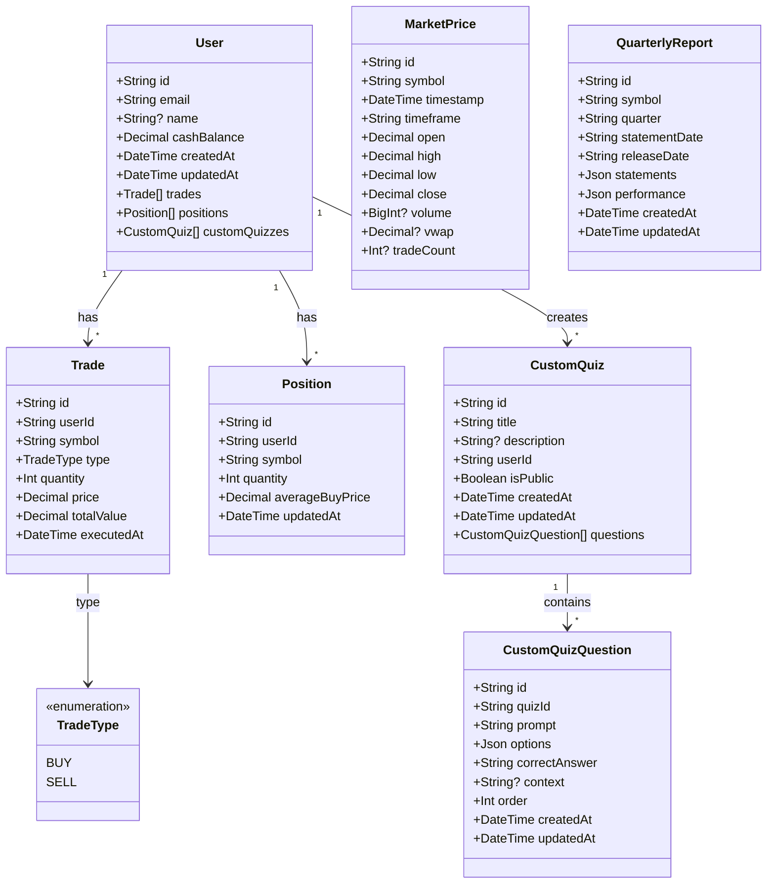
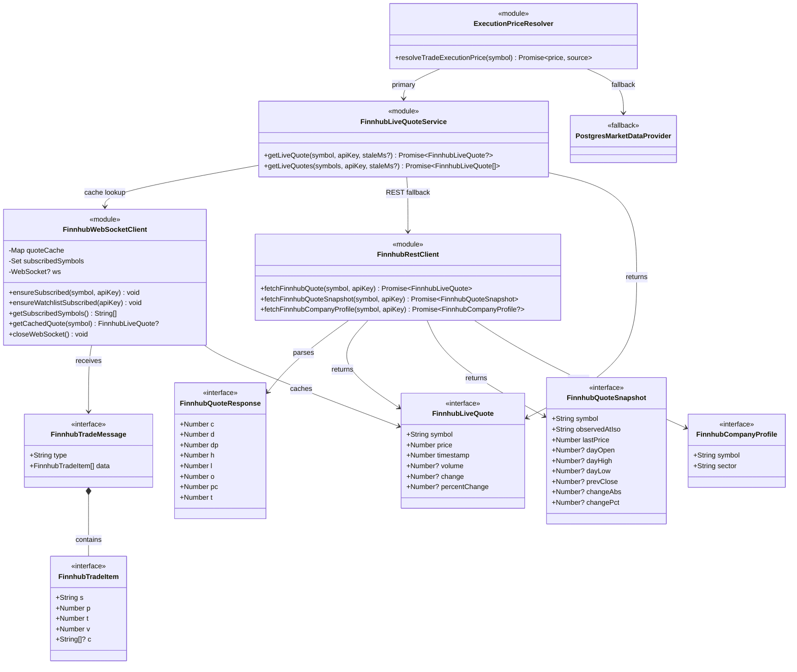
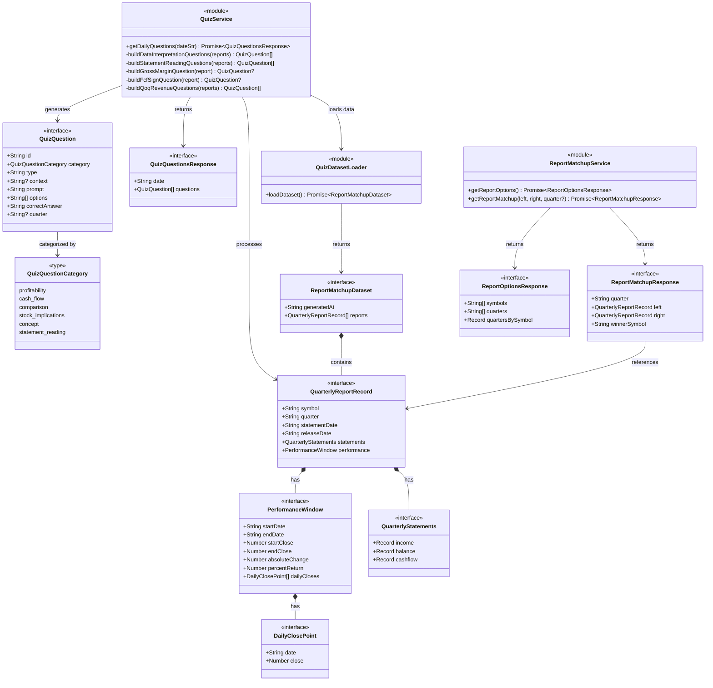
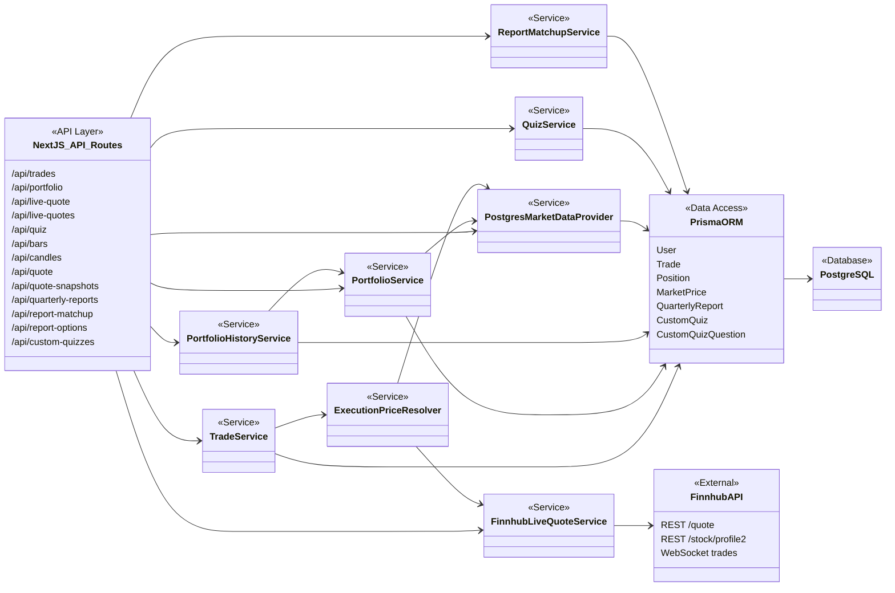

# InvestEd — UML Class Diagram

## Data Models (Prisma Schema)



## Service Layer & Interfaces

```mermaid
classDiagram
    direction TB

    class MarketDataProvider {
        <<interface>>
        +getQuote(symbol: string) Promise~Quote~
        +getQuotes(symbols: string[]) Promise~Quote[]~
    }

    class Quote {
        <<interface>>
        +String symbol
        +Number price
        +Number timestamp
    }

    class PostgresMarketDataProvider {
        +getQuote(symbol: string) Promise~Quote~
        +getQuotes(symbols: string[]) Promise~Quote[]~
    }

    class ExecuteTradeInput {
        <<type>>
        +String userId
        +String symbol
        +String type
        +Number quantity
        +Number price
    }

    class TradeResult {
        <<interface>>
        +Boolean success
        +String? tradeId
        +String? error
        +Decimal? newCashBalance
        +Number? positionQuantity
    }

    class TradeService {
        +executeTrade(input: ExecuteTradeInput) Promise~TradeResult~
        +getUserTrades(userId: string, symbol?: string) Promise~Trade[]~
        +getUserPositions(userId: string) Promise~Position[]~
    }

    class PositionValue {
        <<interface>>
        +String symbol
        +Number quantity
        +Number averageBuyPrice
        +Number currentPrice
        +Number totalCost
        +Number currentValue
        +Number unrealizedPnL
        +Number unrealizedPnLPercent
        +String? sector
    }

    class PortfolioSummary {
        <<interface>>
        +Number totalCash
        +Number totalInvested
        +Number totalCurrentValue
        +Number totalPortfolioValue
        +Number totalUnrealizedPnL
        +Number totalUnrealizedPnLPercent
        +PositionValue[] positions
    }

    class PortfolioService {
        +getPortfolioSummary(userId: string) Promise~PortfolioSummary~
    }

    class PortfolioHistoryPoint {
        <<type>>
        +String at
        +Number value
    }

    class PortfolioHistoryService {
        <<module>>
        +getPortfolioValueHistory(userId: string) Promise~PortfolioHistoryPoint[]~
    }

    MarketDataProvider <|.. PostgresMarketDataProvider : implements
    MarketDataProvider --> Quote : returns

    TradeService --> ExecuteTradeInput : input
    TradeService --> TradeResult : returns
    TradeService ..> "PrismaClient" : uses

    PortfolioService --> PortfolioSummary : returns
    PortfolioService --> MarketDataProvider : uses
    PortfolioSummary *-- PositionValue : contains

    PortfolioHistoryService --> PortfolioHistoryPoint : returns
    PortfolioHistoryService --> PortfolioService : uses
```

## Finnhub Integration



## Quiz & Report Matchup



## Full System Overview


