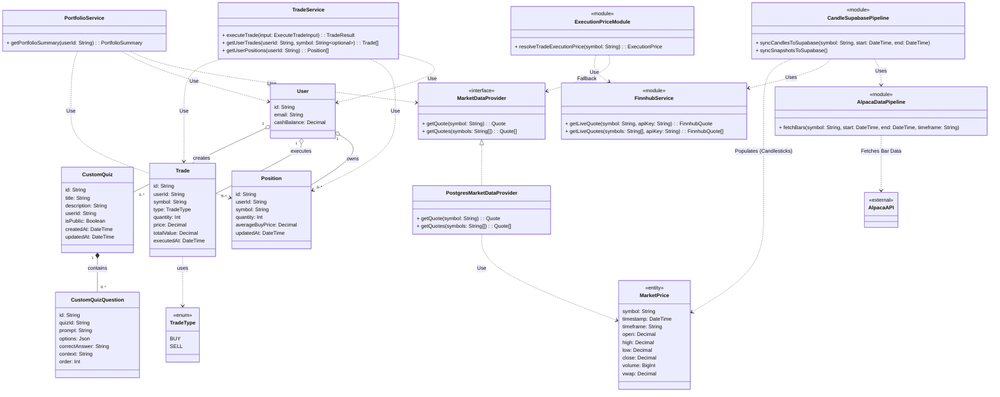

# Updated Architectural UML Diagram

Based on the review of the current codebase (`schema.prisma`, `FOLDER_STRUCTURE.md`, and business logic features), the architecture has been modernized compared to the old diagram. The application now uses direct database models via Prisma (`User`, `Trade`, `Position`, `MarketPrice`, `CustomQuiz`), modular services (`TradeService`, `PortfolioService`), and distinguishes between the `PostgresMarketDataProvider` (storing historical/latest ticks) and `Finnhub` / `Alpaca` pipelines for external data ingestion.

Below is the Mermaid class diagram documenting the updated structure, including Quizzes, Alpaca API, and Candlestick Data Pipelines:

